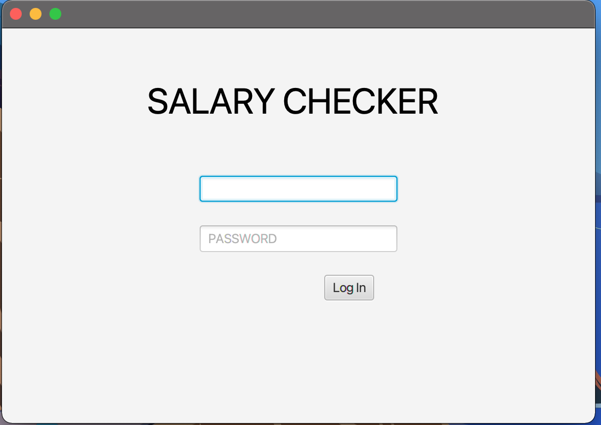

# Documentation for release 1

## For release one the project consists of the following classes and resources:
### CORE:

- [User.java](../../salary-checker/core/src/main/java/salarychecker/core/User.java) :point_right: Creates a new user, get and set methods for all User-attributes.
- [UserValidation.java](../../salary-checker/core/src/main/java/salarychecker/core/UserValidation.java) :point_right: Validates user attributes according to predefined parameters.
- [Account.java](../../salary-checker/core/src/main/java/salarychecker/core/Accounts.java) :point_right: Adds users to a list called Accounts. Methods for retrieving users and updating password.

### JSON
- [AccountsDeserializer](../../salary-checker/core/src/main/java/salarychecker/json/AccountsDeserializer.java) and [AccountsSerializer](../../salary-checker/core/src/main/java/salarychecker/json/AccountsSerializer.java)
- [UserSerializer](../../salary-checker/core/src/main/java/salarychecker/json/UserSerializer.java) and [UserDeserializer](../../salary-checker/core/src/main/java/salarychecker/json/UserDeserializer.java)
- [SalaryCheckerModule](../../salary-checker/core/src/main/java/salarychecker/json/SalaryCheckerModule.java)
- [SalaryCheckerPersistence](../../salary-checker/core/src/main/java/salarychecker/json/SalaryCheckerPersistence.java) :point_right: Class for persistence methods. Write to JSON and read from file.

### UI
- [SalaryCheckerApp.java](../../salary-checker/ui/src/main/java/salarychecker/ui/SalarycheckerApp.java) :point_right: App-class
- [LoginController.java](../../salary-checker/ui/src/main/java/salarychecker/ui/LoginController.java) :point_right: Controller for the login scene.
- [HomepageController](../../salary-checker/ui/src/main/java/salarychecker/ui/HomepageController.java) :point_right: Controller for the user homepage.

    #### Resources:
    - [LogIn.fxml](../../salary-checker/ui/src/main/resources/salarychecker/ui/LogIn.fxml)
    - [HomePage.fxml](../../salary-checker/ui/src/main/resources/salarychecker/ui/HomePage.fxml)

## At release 1 the app will consist of two scenes
- A login window
    
    
  

- A profile window
    
    
    

## Intended functionality for release 1:
- A preexisting, or locally registered user is able log in to the Salary Checker application.
- The logged in user will be able to see a preview of his profile page.

- When clicking the login button it will be verified that the user exists. 
- The user will see the correct credentials when logged in. 

- The initialize method in logincontroller runs a method thats write down test users to a json file located in user.home. To use the app, the user need to find this json file and use the registres email and password to login. We will implement user registration for later release.

## Userstory for release 1:
"An employee at a salesfirm implementing the Salarychecker application wants to check his userprofile, and verify that his personal information is correct. He therefore logs on to Salarychecker and looks at his profile page to view his personal information."

 