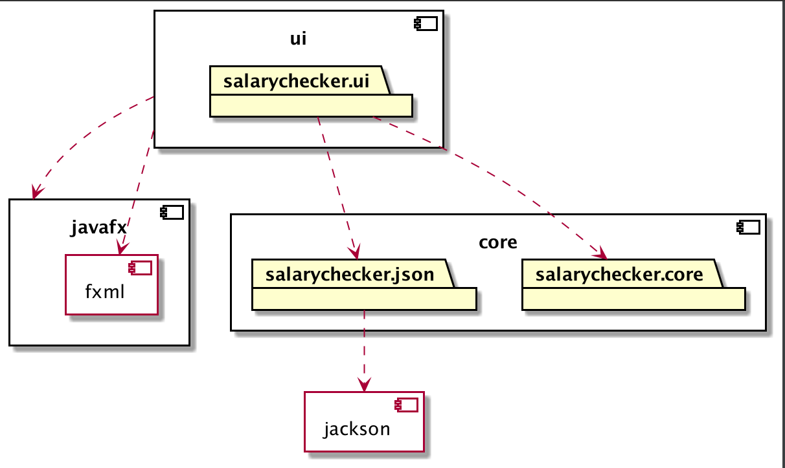

# Salary Checker

## Motivation and purpose for the project:
Many people are employed in the sales industry, and a lot of companies reward their sales-employees based on a bonus scheeme. Payouts can vary based on what products were sold, the employees rank within the company, if the costumer was a new or previous costumer etc. All these factors can make it har to keep track of what is owed to an employee at the end of the month. The SalaryChecker application attempts to solve this problem for the employee.

## Userstories
#### Userstories for later releases will be added as functionality improves during later releases
### Userstory release 1:
    - "An employee at a salesfirm implementing the Salarychecker application wants to check his userprofile, and verify that his personal information is correct. He therefore loggs in to Salarychecker and looks at his profile page to view his personal information."

## Intended functionality at final release:
### For employee (User): 
#### - View his/her personal profile page where he/she gets an overview of the following information:
    - Full name
    - E-mail
    - Employee-number/id 
    - Partially encrypted social security number
    - His/her current tax-bracket 
    - Possibility to change password/e-mail

#### - View the calculation/basis of what salary he/she is owed for current and previous months:
    - A list of all sales with corresponding bonuses
    - A list of all hours worked with corresponding hourly wage
    - Sum of bonuses
    - Sum of hourly wages for all hours worked
    - Final salary 

#### - List of hours worked for current and previous month
    - Hours will be marked differently based on wether it is a regular working day, overtime, weekend, holiday

#### - List of previous payouts
    - Monthly payout before tax
    - Monthly payout after tax

#### - Upload all sales and working hours from a .csv file

#### - Send email to employer directly from the SalaryApplication
    - This functionality is included to simplify the process of complaint in case of an error between salary recieved and salary owed.

### For Employer (Admin):
#### - Create and delete profiles for employees.
    - Admin wil initiate profile with Name, E-mail, Password, taxbracket, and Social security number (Can be changed by user later, except for Social securitynumber.).

## Project structure:
### Project structure will be updated after later releases.

- [docs](../../docs)
    - [release1](../../docs/release1)
        - [README.md](../../docs/release1/README.md) :point_right: Documentation for release 1

- [salary-checker](../salary-checker)
    - [core](./core)
        - [salarychecker/core](./core/src/main/java/salarychecker/core)
            - [User](./core/src/main/java/salarychecker/core/User.java) :point_right: Creates a new user, get and set methods for all User-attributes.
            - [UserValidation](./core/src/main/java/salarychecker/core/UserValidation.java) :point_right: Validates user attributes according to predefined parameters.
            - [Accounts](./core/src/main/java/salarychecker/core/Accounts.java) :point_right: Adds users to a list called Accounts. Methods for retrieving users and updating password.
        - [salarychecker/json](./core/src/main/java/salarychecker/json/)
            - Serializers: [UserSerializers](./core/src/main/java/salarychecker/json/UserSerializer.java) and [AccountsSerializer](./core/src/main/java/salarychecker/json/AccountsSerializer.java) :point_right: These classes serializes the objects to JSON-nodes. This is needed to write a JSON file.
            - Deserializers: [UserDeserializer](./core/src/main/java/salarychecker/json/UserDeserializer.java) and [AccountsDeserializer](./core/src/main/java/salarychecker/json/AccountsDeserializer.java) :point_right: These classes deserializes the JSON nodes to Java objects.
            - [SalaryCheckerModule](./core/src/main/java/salarychecker/json/SalaryCheckerModule.java)
            - [SalaryCheckerPersistence](./core/src/main/java/salarychecker/json/SalaryCheckerPersistence.java) :point_right: Class with methods for reading, writing and loading classes. 
        - [tests](./core/src/test)
                - [UserTest](./core/src/test/java/salarychecker/core/UserTest.java) :point_right: Test for User.java
                - [UserValidationTest](./core/src/test/java/salarychecker/core/UserValidationTest.java) :point_right: Test for UserValidation.java
    - [ui](./ui)
        - [salarychecker/ui](./ui/src/main/java/salarychecker/ui)
            - [SalaryCheckerApp](./ui/src/main/java/salarychecker/ui/SalaryCheckerApp.java) :point_right: App class.
            - [LoginController](./ui/src/main/java/salarychecker/ui/LoginController.java) :point_right: Controller for the login scene.
            - [HomepageController](./ui/src/main/java/salarychecker/ui/HomepageController.java) :point_right Controller for the user homepage.
        - [resources](./ui/src/main/resources)
            - [LogIn.fxml](./ui/src/main/resources/LogIn.fxml) :point_right: FXML-file for login page.
            - [HomePage.fxml](./ui/src/main/resources/HomePage.fxml) :point_right: FXML-file for homepage.
        - [tests](./ui/src/test)
                    

